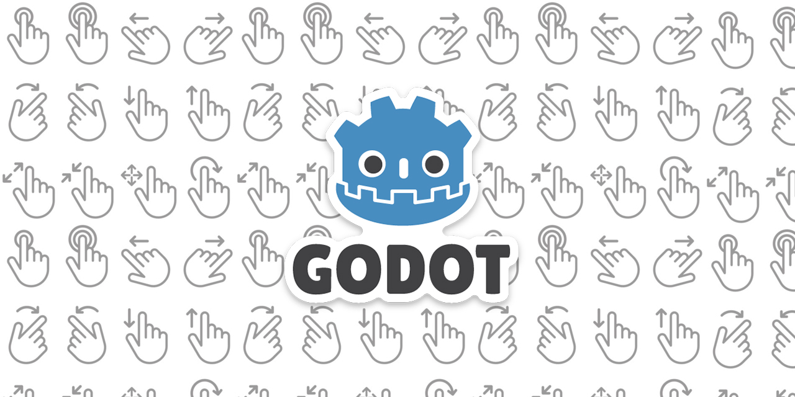

# Godot Input Event Gesture Handler (C#)



A comprehensive solution for handling touch and gesture inputs in Godot Engine using C#. The `InputEventGestureHandler` class provides high-level gesture detection and emits events for various touch gestures such as taps, swipes, pinches, twists, and more.

## Table of Contents

- [Features](#features)
- [Getting Started](#getting-started)
  - [Installation](#installation)
  - [Integration](#integration)
- [Usage](#usage)
  - [Subscribing to Events](#subscribing-to-events)
  - [Available Events](#available-events)
- [Configuration](#configuration)
- [Examples](#examples)
  - [Handling Single Touch and Drag](#handling-single-touch-and-drag)
- [Troubleshooting](#troubleshooting)
- [Contributing](#contributing)
- [License](#license)

## Features

- **Gesture Detection**: Recognizes various touch gestures, including single and multi-finger taps, swipes, pinches, twists, drags, and long presses.
- **Event Emission**: Emits C# events for each recognized gesture, allowing for type-safe and straightforward integration into your game logic.
- **Customizable Thresholds**: Configurable constants for gesture detection thresholds and limits.
- **Mouse Input Emulation**: Supports gesture detection using mouse input for platforms without touch capabilities.
- **Raw Gesture Data**: Provides raw gesture data for advanced usage or custom gesture recognition.

## Getting Started

### Installation

1. **Clone or Download** the `InputEventGestureHandler` folder and include it in your Godot project.
2. **Autoload the InputEventGestureHandler**:
   - In Godot, go to **Project > Project Settings > GLobals**.
   - Click on folder icon right next to the path and select `InputEventGestureHandler.cs`.
   - Set the **Node Name** to `InputEventGestureHandler` and click **+ Add**.

### Integration

1. **Reference the InputEventGestureHandler** in your scripts where you need gesture input:
   ```csharp
   var gestureHandler = InputEventGestureHandler.Instance;
   ```
2. **Subscribe to the desired events** emitted by the `InputEventGestureHandler` (see [Available Events](#available-events)).

## Usage

### Subscribing to Events

To respond to gesture events, subscribe to the events emitted by the `InputEventGestureHandler`.

**Example: Subscribing to Single Touch and Drag Events**

```csharp
public override void _Ready()
{
    var gestureHandler = InputEventGestureHandler.Instance;
    gestureHandler.SingleTouch += OnTouch;
    gestureHandler.SingleDrag += OnDrag;
    ...
}
```

### Available Events

The `InputEventGestureHandler` emits the following C# events:

- `event Action<string, InputEvent> AnyGesture`
- `event Action<InputEventSingleScreenTap> SingleTap`
- `event Action<InputEventSingleScreenSwipe> SingleSwipe`
- `event Action<InputEventSingleScreenTouch> SingleTouch`
- `event Action<InputEventSingleScreenDrag> SingleDrag`
- `event Action<InputEventSingleScreenLongPress> SingleLongPress`
- `event Action<InputEventMultiScreenTap> MultiTap`
- `event Action<InputEventMultiScreenSwipe> MultiSwipe`
- `event Action<InputEventMultiScreenTouch> MultiTouch`
- `event Action<InputEventMultiScreenDrag> MultiDrag`
- `event Action<InputEventMultiScreenLongPress> MultiLongPress`
- `event Action<InputEventScreenPinch> Pinch`
- `event Action<InputEventScreenTwist> Twist`
- `event Action<RawGesture> RawGesture`
- `event Action<InputEventScreenCancel> Cancel`

## Configuration

The `InputEventGestureHandler` includes configurable constants to adjust gesture detection sensitivity and thresholds:

```csharp
private const bool DEFAULT_BINDINGS = true;
private const bool DEBUG = false;

// Time threshold to consider a drag gesture.
private const float DRAG_STARTUP_TIME = 0.02f;

// Finger size used to define thresholds in gesture calculations.
private const float FINGER_SIZE = 100.0f;

// Time threshold to detect multi-finger release gestures.
private const float MULTI_FINGER_RELEASE_THRESHOLD = 0.1f;

// Time and distance thresholds for detecting tap gestures.
private const float TAP_TIME_LIMIT = 0.2f;
private const float TAP_DISTANCE_LIMIT = 25.0f;

// Time and distance limits for detecting long press gestures.
private const float LONG_PRESS_TIME_THRESHOLD = 0.75f;
private const float LONG_PRESS_DISTANCE_LIMIT = 25.0f;

// Time and distance thresholds for detecting swipe gestures.
private const float SWIPE_TIME_LIMIT = 0.5f;
private const float SWIPE_DISTANCE_THRESHOLD = 200.0f;
```

Adjust these values as needed for your game's input requirements.

## Examples

### Handling Single Touch and Drag

**Example Implementation:**

```csharp
public partial class PlayerController : Node
{

    ...

    public override void _Ready()
    {
        var gestureHandler = InputEventGestureHandler.Instance;
        gestureHandler.SingleTouch += OnTouch;
        gestureHandler.SingleDrag += OnDrag;
    }

    private void OnTouch(InputEventSingleScreenTouch touchEvent)
    {
        ...
    }

    private void OnDrag(InputEventSingleScreenDrag dragEvent)
    {
        ...
    }

    ...

}
```

## Troubleshooting

- **Event Not Emitted**: Ensure that you are subscribing to the correct event and that the event name matches exactly.
- **Event Name Mismatch**: Event names are case-sensitive. Use the `+=` operator to subscribe to events:
  ```csharp
  gestureHandler.SingleTap += OnSingleTap;
  ```
- **No Gesture Recognition**: Verify that the `InputEventGestureHandler` is properly added as an autoload singleton and that `_Input` is being called.
- **Null Reference Exception**: Ensure that `InputEventGestureHandler.Instance` is not `null` and that the handler is properly initialized.

## Contributing

Contributions are welcome! Please follow these steps:

1. **Fork the Repository**
2. **Create a Feature Branch** (`git checkout -b feature/your-feature`)
3. **Commit Your Changes** (`git commit -am 'Add new feature'`)
4. **Push to the Branch** (`git push origin feature/your-feature`)
5. **Open a Pull Request**

## License

This project is licensed under the MIT License - see the [LICENSE](LICENSE) file for details.

---

By following these guidelines and adjusting your `InputEventGestureHandler` class accordingly, you'll ensure that your gesture handling system works smoothly with C# events, providing a robust and type-safe interface for gesture recognition in your Godot projects.

If you have any questions or need further assistance, feel free to ask!